<html>
<h1>Create first Rest micro-service(api) </h1>
<h3>using spring data rest</h3>
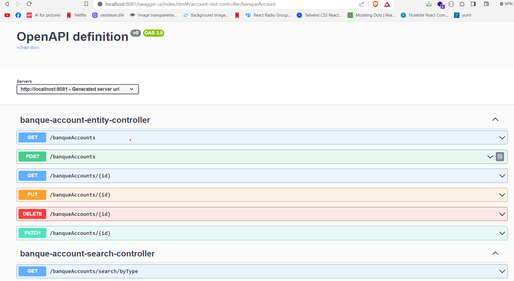
<h3>using rest controller</h3>
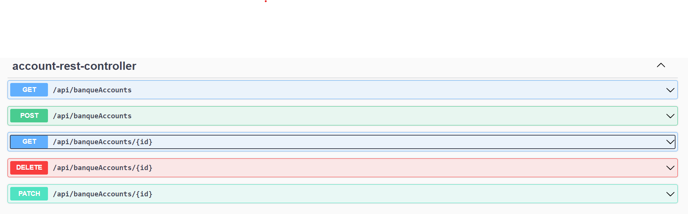
<h3>test getting all bank accounts</h3>
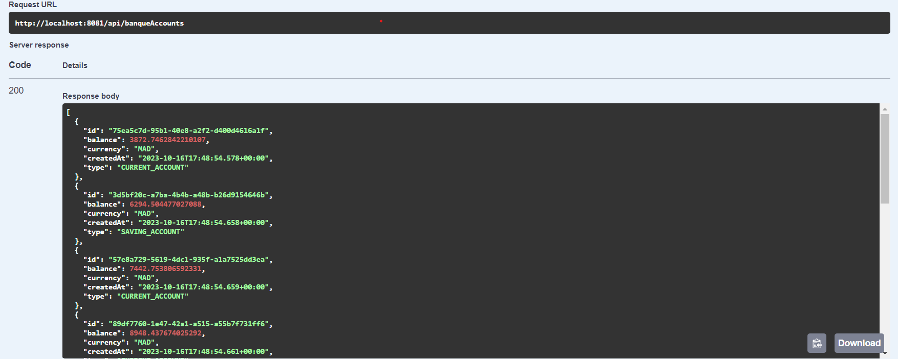
<h3>test adding account</h3>
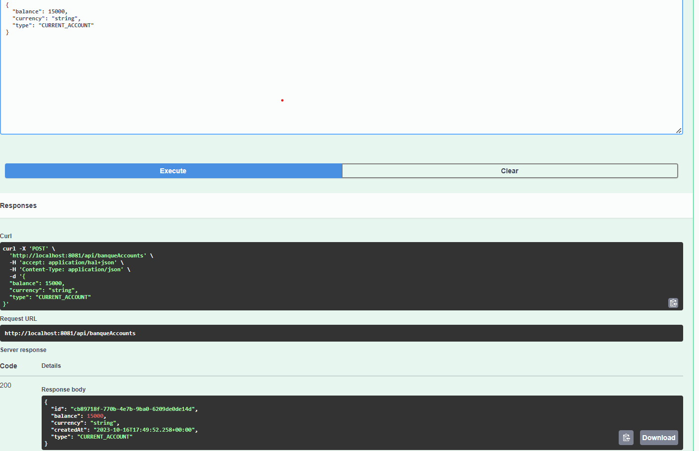
<h3>test getting account by id</h3>
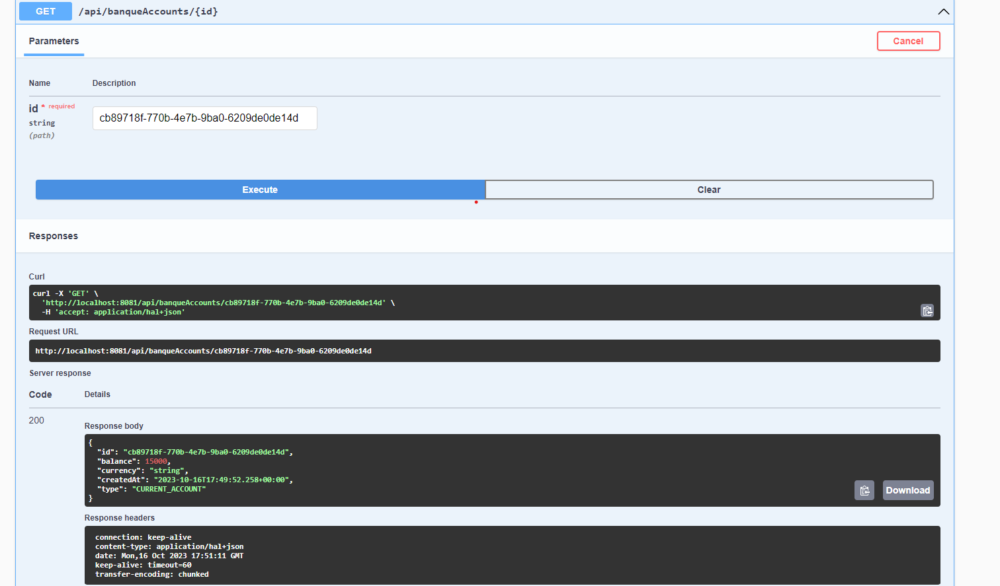
<h3>test delete account</h3>
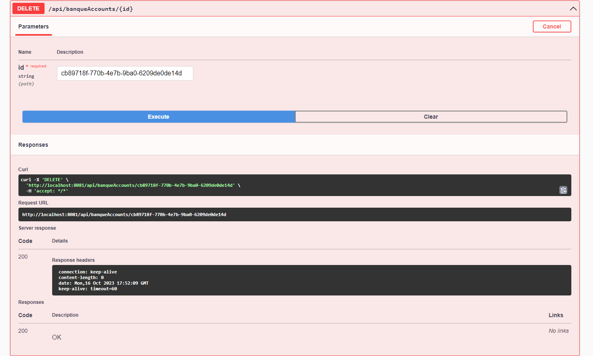
<h3>test patch request (updating specific account fields)</h3>
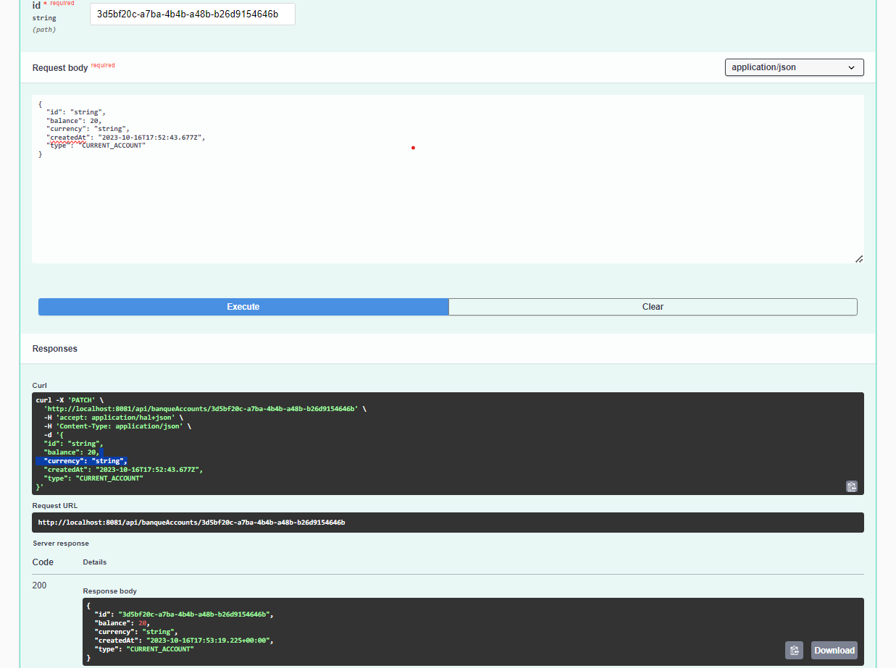
<h3>get accounts by type</h3>
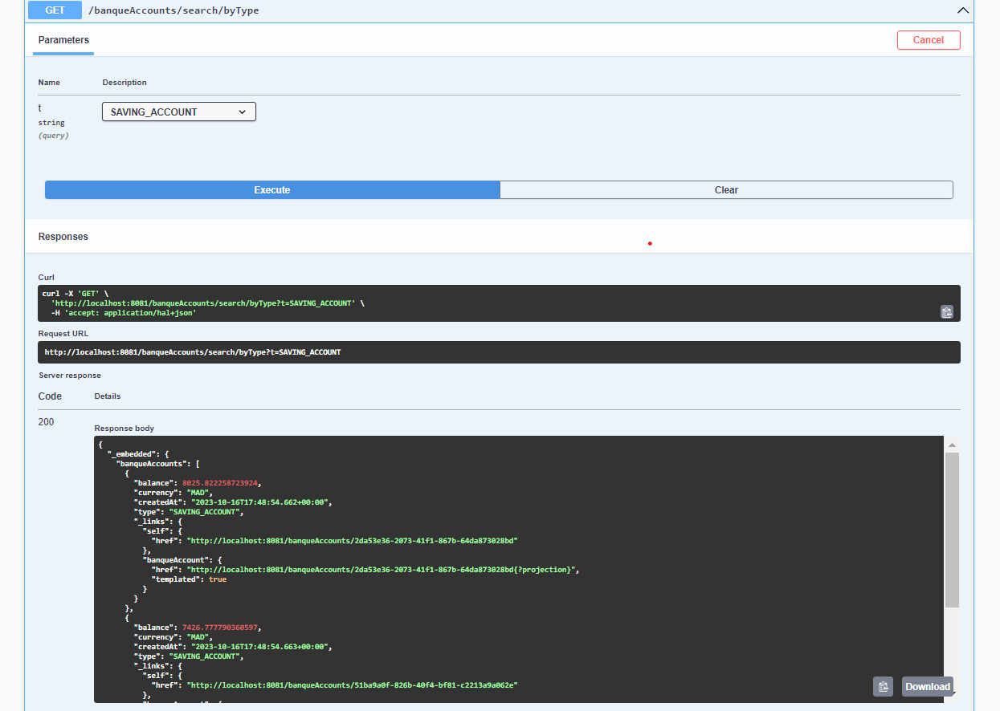

<h2>GraphQL</h2>
<h3>List Accounts</h3>
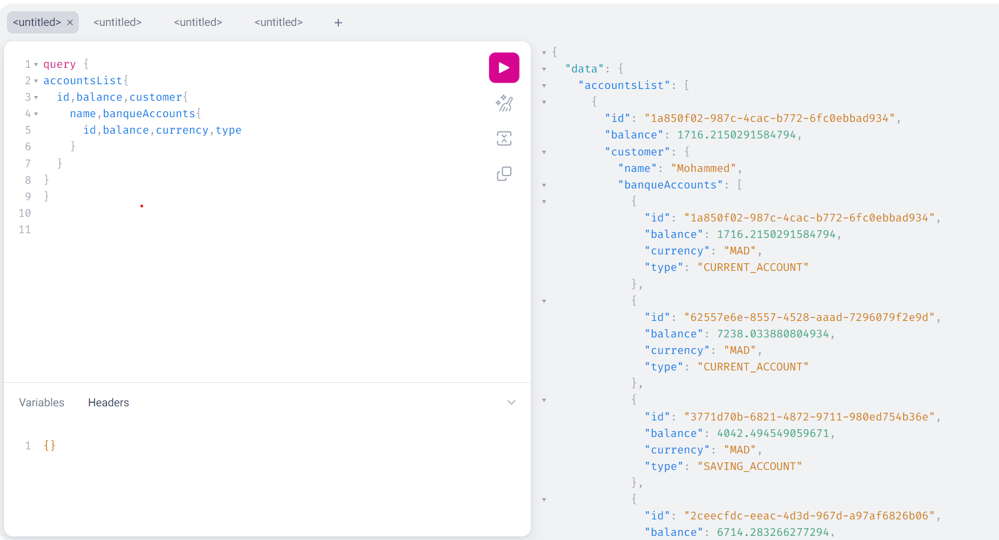
<h3>Add Account</h3>
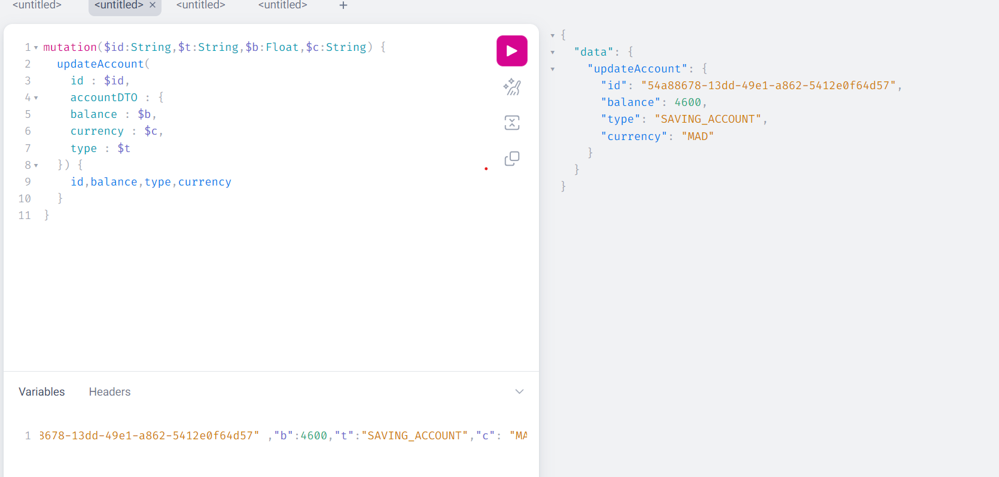
<h3>Delete Account</h3>
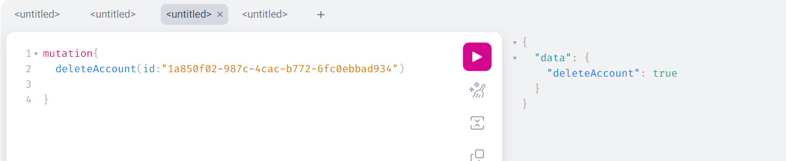
<h3>List customers</h3>
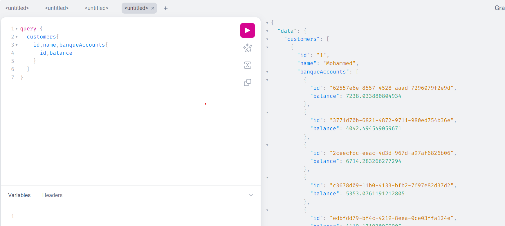

</html>